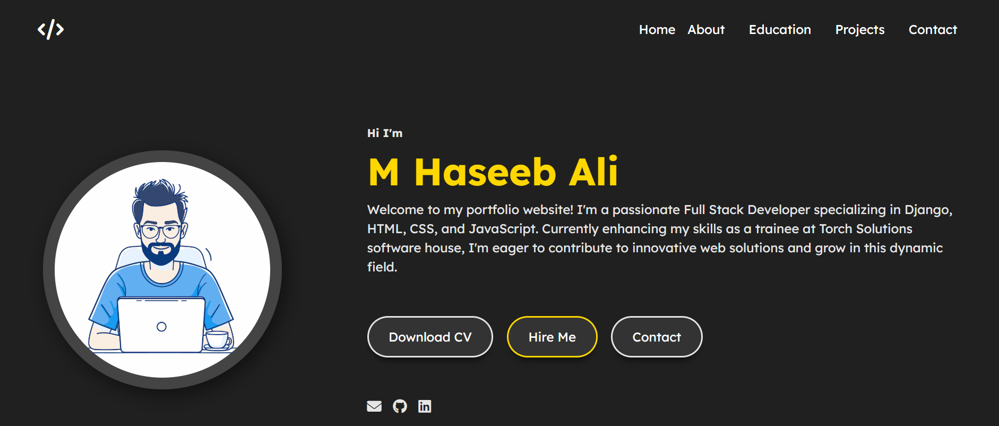

# 💼 M Haseeb Ali - Portfolio Website

Welcome to my personal portfolio website! This site showcases my journey as a **Full Stack Developer**, featuring my education, professional experience, and the projects I've worked on.

## 👨‍💻 About Me

I’m **M Haseeb Ali**, a passionate Full Stack Developer from Pakistan, currently a trainee at Torch Solutions Software House. I specialize in **Django**, **HTML**, **CSS**, and **JavaScript**, and I’m dedicated to building clean, responsive, and user-friendly web applications.

## 🔧 Built With

- **HTML5** – Semantic and structured layout  
- **CSS3** – Custom styling and responsiveness  
- **JavaScript** – Interactive elements and form handling  

## 📸 Preview

## 📂 Features

- Responsive design with smooth user experience  
- Project links with GitHub repositories  
- Contact form using `mailto:` functionality  
- Education and professional experience timeline  

Thanks for checking out my portfolio!  
Feel free to reach out via [email](mailto:haseeb.codes.25@gmail.com) or connect on [LinkedIn](https://www.linkedin.com/in/mhaseebali-pythonlover/).
